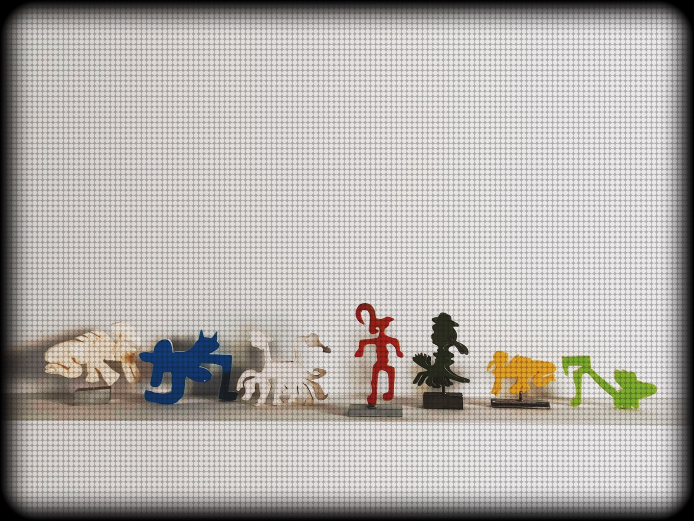

# Sike Society

> _A purely functional simulation engine of a secret society — modeled in Haskell._

---

## Origin

Sike Society did not begin as code. It began as a physical work of art —
a set of handcrafted figures representing the seven members of a fictional
secret society, each distinct in form, color, and character.



_The seven, as they exist in the physical world._

This repository is the formal articulation of that work in Haskell. The
characters, their domains, their rules of interaction — all originate
from the art. The code translates a long-held universe into the language
of types, pure functions, and composable behavior.

---

## About

**Sike Society** is a functional simulation of a fictional secret society
that operates in the shadows to maintain peace across the globe. The project
models a disciplined, hierarchical, altruistic group of seven symbolic
characters — each bounded in their own domain — responding collectively to
unpredictable external threats.

Unlike typical simulation projects built on mutable state and object-oriented
abstractions, every aspect of Sike Society is expressed through **pure
functions**, **algebraic data types**, and **type-driven design**. The
simulation is deterministic, referentially transparent, and reasoned about
as mathematics rather than procedure.

This is not a game. This is a meditation on how a language with no hidden
side effects can describe a world with seven guardians, external threats,
and the emergent harmony that arises between them.

---

## The Seven

| Character    | Domain        | Role                                           |
| ------------ | ------------- | ---------------------------------------------- |
| **Sike**     | All           | The head. Commander. Foresees one step ahead.  |
| **Tobi**     | Ocean, Earth  | Guardian of the waters. Keeper of peace.       |
| **Travis**   | Ocean         | Enforcer against illegal underwater business.  |
| **Skye**     | Sky           | Guardian of the sky. Watches for threats.      |
| **Leyton**   | Hidden, Earth | Keeper of ancient knowledge. The first one.    |
| **Terry100** | Hidden, All   | The listener. Intelligence officer.            |
| **DrLeyton** | Hidden        | Healer. Guardian of the secret of immortality. |

For full character profiles, interaction rules, and design rationale,
see [`docs/DESIGN.md`](docs/DESIGN.md).

---

## Design Philosophy

The project rests on four commitments:

1. **Purity.** All simulation logic is expressed as pure functions. Side
   effects are confined to a single `Main` module. The world never mutates;
   each step returns a new `World`.
2. **Type safety.** Invalid states are made unrepresentable. The type
   system encodes what a character can do, where they can act, and what
   they cannot.
3. **Composability.** Complex behavior emerges from the composition of
   small, total, named operations — not from monolithic procedures.
4. **Narrative fidelity.** Every technical decision serves the story.
   The code is not a translation of the concept; it _is_ the concept.

---

## Getting Started

### Prerequisites

- [GHC](https://www.haskell.org/ghc/) 9.4 or later
- [Cabal](https://www.haskell.org/cabal/) 3.8 or later (recommended) or
  [Stack](https://docs.haskellstack.org/)

### Build

```bash
cabal update
cabal build
```

### Run

```bash
cabal run sike-society
```

### Test

```bash
cabal test
```

---

## Project Structure

```
sike-society/
├── app/
│   └── Main.hs              # Entry point; demonstration scenarios
├── src/
│   ├── Types.hs             # Algebraic data types and type classes
│   ├── Characters.hs        # Definitions of the seven members
│   ├── Threats.hs           # External threats and their behavior
│   ├── Interaction.hs       # Continuous and engagement rules
│   └── Simulation.hs        # step and simulate engine functions
├── test/
│   └── Spec.hs              # QuickCheck properties and HUnit tests
├── docs/
│   └── DESIGN.md            # Full design document
├── sike-society.cabal       # Package configuration
├── .gitignore
├── LICENSE
└── README.md
```

---

## Tech Stack

- **Language:** Haskell (GHC 9.x)
- **Build tool:** Cabal
- **Testing:** QuickCheck (property-based) and HUnit (unit)
- **Paradigm:** Purely functional, type-driven development

---

## Status

Sike Society is an evolving project. The first milestone — a complete,
working simulation engine with the full seven-character roster — is under
active development, with the initial release targeted for **May 2026**.

Beyond the first release, the engine is designed to be extended: new
characters, new threats, richer interaction algebras, and alternative event
schedules can all be introduced without rewriting existing code. The type
system was built with this extensibility in mind from day one.

Progress is visible in the commit history.

---

## Roadmap

- [x] Design document and project scaffolding
- [ ] Core type system and algebraic data types
- [ ] Character definitions and initial world state
- [ ] External threats and domain-aware engagement
- [ ] Simulation engine (`step` and `simulate`)
- [ ] QuickCheck property tests
- [ ] Demonstration scenarios and terminal output
- [ ] First public release

---

## Author

**Alban Tahiri**

The Sike Society universe predates this codebase — it exists first as
physical art, then as written mythology, and now as a working simulation.
This repository is the third form of the same idea.

---

## License

Released under the MIT License. See [LICENSE](LICENSE) for full terms.

You are free to study, adapt, and build upon this work. Attribution is
appreciated but not required.
