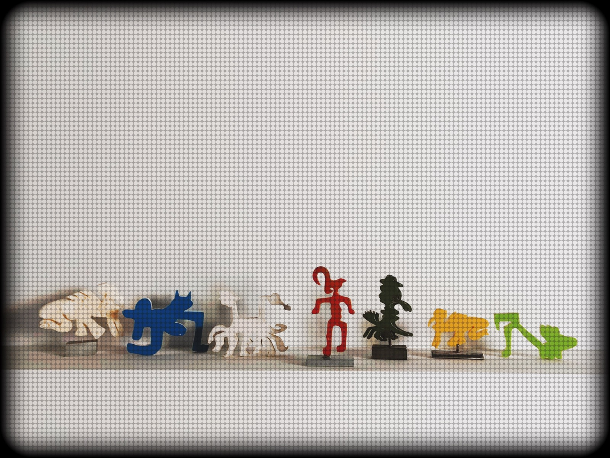

# Sike Society

> _A purely functional simulation engine of a secret society — modeled in Haskell._

---

## Origin

Sike Society did not begin as code. It began as a physical work of art —
a set of handcrafted figures representing the seven members of a fictional
secret society, each distinct in form, color, and character.



_The seven, as they exist in the physical world._

This repository is the formal articulation of that work in Haskell. The
characters, their domains, their rules of interaction — all originate
from the art. The code translates a long-held universe into the language
of types, pure functions, and composable behavior.

---

## About

**Sike Society** is a functional simulation of a fictional secret society
that operates in the shadows to maintain peace across the globe. The project
models a disciplined, hierarchical, altruistic group of seven symbolic
characters — each bounded in their own domain — responding collectively to
unpredictable external threats.

Unlike typical simulation projects built on mutable state and object-oriented
abstractions, every aspect of Sike Society is expressed through **pure
functions**, **algebraic data types**, and **type-driven design**. The
simulation is deterministic, referentially transparent, and reasoned about
as mathematics rather than procedure.

This is not a game. This is a meditation on how a language with no hidden
side effects can describe a world with seven guardians, external threats,
and the emergent harmony that arises between them.

The first milestone of the engine was reached in **May 2026**.

---

## The Seven

| Character    | Domain        | Energy / Influence | Role                                           |
| ------------ | ------------- | ------------------ | ---------------------------------------------- |
| **Sike**     | All           | 100 / 100          | The head. Commander. Foresees one step ahead.  |
| **Tobi**     | Ocean, Earth  | 98 / 95            | Guardian of the waters. Keeper of peace.       |
| **Travis**   | Ocean         | 97 / 90            | Enforcer against illegal underwater business.  |
| **Skye**     | Sky           | 97 / 90            | Guardian of the sky. Watches for threats.      |
| **Leyton**   | Hidden, Earth | 97 / 90            | Keeper of ancient knowledge. The first one.    |
| **Terry100** | All           | 97 / 90            | The listener. Intelligence officer.            |
| **DrLeyton** | Hidden        | 98 / 95            | Healer. Guardian of the secret of immortality. |

For full character profiles, interaction rules, and design rationale,
see [`docs/DESIGN.md`](docs/DESIGN.md).

---

## The Four Threats

The world faces four canonical threats, each bounded by a domain and
characterized by a hostility level and an energy reserve:

| Threat                 | Domain | Hostility | Energy | Narrative                               |
| ---------------------- | ------ | --------- | ------ | --------------------------------------- |
| **SpyPigeons**         | Sky    | 15        | 30     | Spy pigeons selling intel to Aliens.    |
| **OceanAbuser**        | Ocean  | 25        | 50     | Polluters of the deep waters.           |
| **Aliens**             | Earth  | 80        | 150    | Catastrophic. Forewarned by SpyPigeons. |
| **AncientDisturbance** | Hidden | 60        | 100    | Recognized only by Leyton.              |

The threats are not isolated. SpyPigeons inform the Aliens; Aliens arrive
already aware. The data itself encodes the story.

---

## Design Philosophy

The project rests on four commitments:

1. **Purity.** All simulation logic is expressed as pure functions. Side
   effects are confined to a single `Main` module. The world never mutates;
   each step returns a new `World`.
2. **Type safety.** Invalid states are made unrepresentable. The type
   system encodes what a character can do, where they can act, and what
   they cannot.
3. **Composability.** Complex behavior emerges from the composition of
   small, total, named operations — not from monolithic procedures.
4. **Narrative fidelity.** Every technical decision serves the story.
   The code is not a translation of the concept; it _is_ the concept.

---

## What You Can Do

The compiled executable offers two complementary modalities for exploring
the simulation.

### Mode 1 — Automatic Mission

A five-mission narrative scenario plays out in sequence. The user controls
the pacing by pressing Enter between missions. Each mission demonstrates
a different aspect of the simulation:

1. **Distant Whispers** — Terry100 gathers intelligence.
2. **The Sky Threat** — Skye engages the SpyPigeons.
3. **The Invasion** — Four members mobilize against the Aliens.
4. **The Healer** — DrLeyton restores the wounded.
5. **The Tide of Coin** — Travis collects ocean coins from underground clients.

### Mode 2 — Command Terminal

An interactive command-line interface where the user issues commands
directly to members of the society. The world persists between commands,
demonstrating state evolution in a purely functional setting:

```
============================================================
            SIKE SOCIETY - Command Terminal
============================================================

  [1] Listen for threats         (Terry100)
  [2] Engage a threat            [coming soon]
  [3] Heal a wounded member      [coming soon]
  [4] Collect ocean coins        (Travis)
  [5] Show world status
  [b] Back to main menu
  [q] Exit

> _
```

The terminal is built on top of an algebraic data type `Command` with
exhaustive pattern matching, so adding new commands becomes a compile-time
checked operation.

---

## Getting Started

### Prerequisites

- [GHC](https://www.haskell.org/ghc/) 9.4 or later (tested on 9.8.2)
- [Cabal](https://www.haskell.org/cabal/) 3.0 or later

### Build

```bash
cabal update
cabal build
```

### Run

```bash
cabal run sike-society
```

### Explore Interactively (GHCi)

```bash
cabal repl
```

Then, inside GHCi:

```haskell
:module + Types Characters Threats Interaction
```

From here, every function in the project is individually testable:

```haskell
ghci> allMembers
[Sike,Tobi,Travis,Skye,Leyton,Terry100,DrLeyton]

ghci> operatesIn Earth (initialMember Skye)
False

ghci> effectiveness (initialMember Sike) aliens
100

ghci> worldIntelligence (terryListens 50 initialWorld)
50

ghci> worldIntelligence initialWorld
0
```

The original world is never mutated. Each action produces a new world.

---

## Project Structure

```
sike-society/
├── app/
│   └── Main.hs              # Entry point; two execution modalities
├── src/
│   ├── Types.hs             # Algebraic data types and type classes
│   ├── Characters.hs        # The seven members and initial world state
│   ├── Threats.hs           # The four canonical threats
│   ├── Interaction.hs       # Type class instances and narrative actions
│   └── Simulation.hs        # step and simulate (planned)
├── test/
│   └── Spec.hs              # QuickCheck and HUnit (infrastructure ready)
├── docs/
│   ├── DESIGN.md            # Full design document
│   └── images/              # Reference images of the physical artwork
├── sike-society.cabal       # Package configuration
├── .gitignore
├── LICENSE
└── README.md
```

---

## Modules at a Glance

- **`Types.hs`** — The vocabulary of the universe. Defines `Domain`,
  `CharacterState`, `MemberId`, `ThreatKind`, plus the `Member`, `Threat`,
  and `World` records. Declares the two custom type classes `Interactable`
  and `Transformable`.
- **`Characters.hs`** — The seven members as concrete data. Includes
  `archetype`, `initialMember`, `initialMembers`, `initialWorld`, and the
  `describeWorld` formatter.
- **`Threats.hs`** — The four canonical threats with their narrative
  descriptions.
- **`Interaction.hs`** — The laws of the simulation. Implements
  `Interactable Member` and `Transformable Member`, plus the three narrative
  actions `terryListens`, `drLeytonHeals`, and `travisCollects`.
- **`Main.hs`** — The impure shell. Holds the main menu, the automatic
  mission runner, and the interactive command terminal with its `Command`
  ADT and exhaustive parser.
- **`Simulation.hs`** — Intentional stub. Reserved for the `step` and
  `simulate` engine functions to be implemented in a future release.

---

## Tech Stack

- **Language:** Haskell (GHC 9.x, tested on 9.8.2)
- **Build tool:** Cabal 3.0
- **Dependencies:** `base ^>=4.19`, `containers ^>=0.6`
- **Testing:** QuickCheck (property-based) and HUnit (unit) — infrastructure ready
- **Paradigm:** Purely functional, type-driven development

---

## Status

Sike Society reached its first milestone in **May 2026** — a complete,
working simulation engine with the full seven-character roster, the four
canonical threats, a five-mission narrative scenario, and an interactive
command terminal built on top of an algebraic data type.

The engine is designed to be extended: new characters, new threats, richer
interaction algebras, and alternative event schedules can all be introduced
without rewriting existing code. The type system was built with this
extensibility in mind from day one.

Progress is visible in the commit history.

---

## Roadmap

- [x] Design document and project scaffolding
- [x] Core type system and algebraic data types
- [x] Character definitions and initial world state
- [x] External threats and domain-aware engagement
- [x] `Interactable` and `Transformable` type class implementations
- [x] Narrative actions (`terryListens`, `drLeytonHeals`, `travisCollects`)
- [x] Automatic mission scenario with five missions
- [x] Interactive command terminal with `Command` ADT
- [x] Demonstration scenarios and formatted terminal output
- [x] First public release (May 2026)
- [ ] Simulation engine (`step` and `simulate`)
- [ ] QuickCheck property tests
- [ ] Full implementation of `Engage` and `Heal` commands in the terminal
- [ ] AncientDisturbance scenario expansion

---

## Author

**Alban Tahiri**

The Sike Society universe predates this codebase — it exists first as
physical art, then as written mythology, and now as a working simulation.
This repository is the third form of the same idea.

---

## License

Released under the MIT License. See [LICENSE](LICENSE) for full terms.

You are free to study, adapt, and build upon this work. Attribution is
appreciated but not required.
